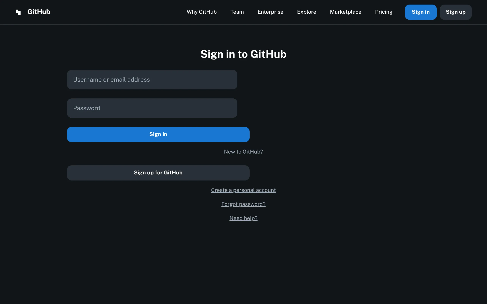
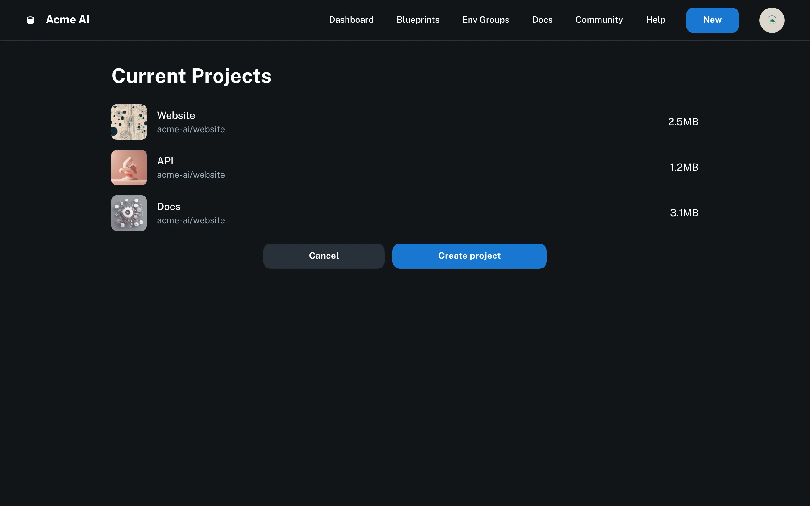
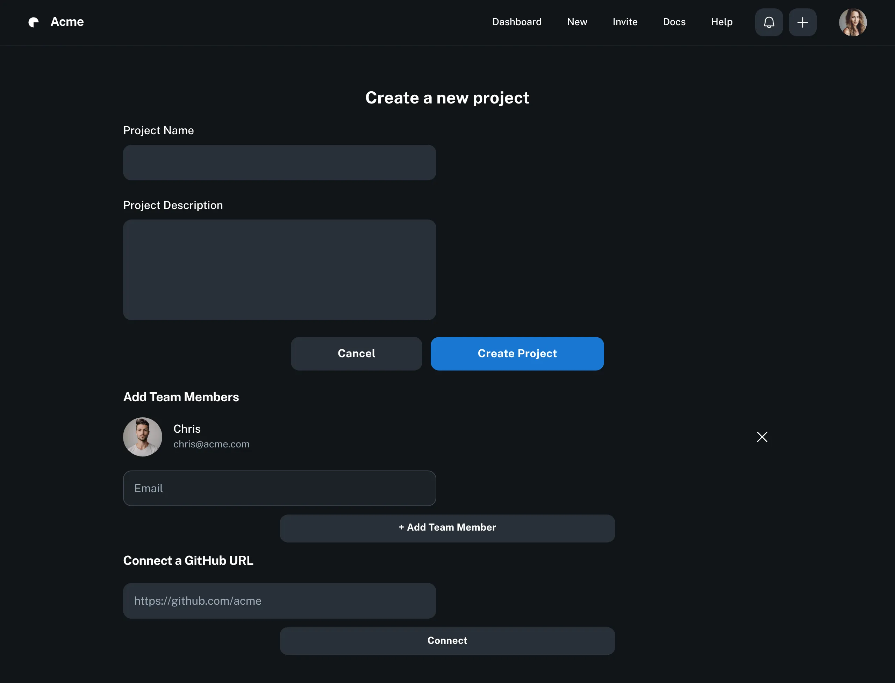
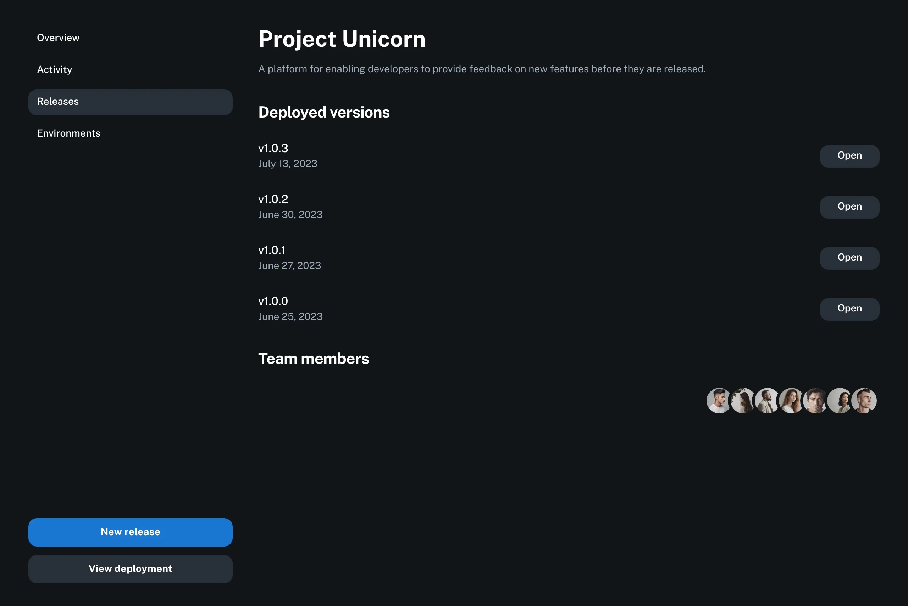

# Intellisia

**GRPC OK** 

---

## 우리가 주목한 문제와 Intellisia의 탄생

개발 속도를 저해하지 않으면서 **강력한 공급망 보안**을 유지하는 것은 오늘날 소프트웨어 개발팀의 가장 큰 과제 중 하나입니다. 수동적인 보안 검토 프로세스는 배포 파이프라인의 병목이 되기 쉽고, 개발자가 보안 취약점을 뒤늦게 파악하게 만들어 수정 비용을 증가시킵니다. 또한, 팀마다 다른 배포 방식과 보안 적용 기준은 비효율과 일관성 부족을 야기합니다.

우리는 이러한 현실적인 문제들에 주목했습니다. **어떻게 하면 개발 워크플로우에 보안 점검을 자연스럽게 녹여내 개발 생산성을 높이면서도, 회사의 보안 정책을 기술적으로 강제하고 중앙에서 관리할 수 있을까?** 이 고민에서 **Intellisia** 프로젝트가 시작되었습니다. Intellisia는 **GitOps 기반의 자동화된 공급망 보안 및 개발자 생산성 향상 플랫폼**을 통해 이러한 문제에 대한 해답을 제시합니다.

---

## Intellisia란 무엇인가?

Intellisia는 **DevSecOps**와 **GitOps**을 결합하여, 소스코드 커밋부터 최종 배포까지의 과정을 자동화하고 그 과정에 보안 점검 및 정책 기반의 배포 승인/거부 로직을 통합한 플랫폼입니다. 개발팀이 보안을 '따로' 신경 쓰는 것이 아니라, '당연하게' 거쳐야 하는 과정의 일부로 만들어 보안 도입의 허들을 낮추고, 개발 생산성을 극대화하는 것을 목표로 합니다.

---

## 핵심 컨셉 및 워크플로우

Intellisia는 Git을 중심으로 돌아가는 GitOps 워크플로우에 보안 자동화 단계를 효과적으로 삽입합니다. 핵심 컨셉은 다음과 같습니다.

* **Git as a Single Source of Truth:** 모든 배포 가능한 상태(코드, 설정, 배포 명세)는 Git 리포지토리에 저장됩니다.
* **Automated Security Gates:** Git 변경이 발생하면(PR 또는 Merge), 미리 정의된 보안 정책에 따라 자동화된 보안 점검이 실행됩니다.
* **Policy-driven Deployment:** 보안 점검 결과가 정책을 만족하는 경우에만 다음 단계(배포 승인 요청 또는 자동 승인)로 진행됩니다. 정책 위반 시 명확한 이유와 함께 워크플로우가 중단됩니다.
* **Declarative Deployment:** 승인된 변경 사항은 ArgoCD를 통해 쿠버네티스 클러스터에 선언적으로 배포됩니다.

---

## 누가 Intellisia를 사용하고, 어떤 가치를 얻을까요?

### 개발자

- 쉬운 시작, 빠른 온보딩: 표준화된 프로젝트 템플릿을 통해 신규 프로젝트를 몇 번의 클릭만으로 생성하고 배포 워크플로우를 구성할 수 있습니다. 더 이상 복잡한 설정에 시간을 낭비하지 않습니다.
- 워크플로우의 간소화: 복잡한 빌드, 스캔, 배포 요청 과정을 직관적인 UI를 통해 클릭 몇 번으로 실행하고 관리할 수 있습니다.
- 즉각적인 보안 피드백: 코드 커밋 또는 PR 생성 시 자동으로 실행되는 보안 스캔 결과를 플랫폼 UI를 통해 즉시 확인합니다. 취약점을 개발 초기 단계에 발견하고 수정하여 시간과 비용을 절약합니다.
- 명확한 배포 실패 이유: 배포가 정책 위반으로 인해 차단된 경우, 구체적인 정책 위반 내용과 관련 취약점 정보를 플랫폼에서 바로 확인하고 문제를 해결할 수 있습니다. 

### 플랫폼 엔지니어

- 중앙 집중식 보안 정책 관리: 회사 또는 팀의 보안 정책을 Intellisia 플랫폼에 정의하고, 모든 프로젝트에 일관되게 적용할 수 있습니다. 정책 기반으로 기술적 강제를 수행합니다.
- 자동화된 보안 점검 적용: 소스코드 분석(Semgrep) 및 컨테이너 이미지 스캔(Trivy)을 개발 파이프라인에 자동 통합하여 수동 검토 부담을 줄입니다
- 취약점 및 정책 위반 현황 가시성: 관리하는 모든 프로젝트의 보안 점검 결과, 취약점 현황, 정책 위반 여부를 대시보드에서 한눈에 파악합니다.
- 정책 기반 배포 제어: 정의된 보안 정책을 만족하는 경우에만 배포가 진행되도록 강제합니다. 배포 승인/거부 과정에 보안 검토 결과를 핵심적인 판단 근거로 활용합니다. (필요시 관리자 수동 승인/반려 기능 활용)
- 안정적이고 감사 가능한 배포: GitOps(ArgoCD)를 통해 배포의 안정성과 반복 가능성을 확보하며, 모든 배포 요청 및 승인/거부 이력을 감사 로그로 남겨 추적 가능성을 높입니다.

--- 

## 기술 스택

본 프로젝트는 다음 기술 스택으로 구성되었습니다.

| 카테고리                       | 기술 스택                          | 선택 이유                                                                          |
| :----------------------------- | :--------------------------------- | :--------------------------------------------------------------------------------- |
| Frontend                       | `Next.js`, `TypeScript`            | React 생태계 기반, 서버 렌더링 및 API 라우팅 지원으로 백엔드 연동 용이, 타입 안정성 추구 |
| Backend                        | `Next.js`, `TypeScript`            | 풀스택 프레임워크 활용, 빠른 API 개발, 타입 안정성 및 개발 생산성                       |
| Database                       | `PostgreSQL`                       | 안정적이고 기능이 풍부한 관계형 DB, 프로젝트 메타데이터 및 보안 결과 저장에 적합         |
| Containerization               | `Docker`                           | 애플리케이션 및 종속성 패키징, 일관된 실행 환경 제공                                   |
| Static Code Analysis           | `Semgrep`                          | 다양한 언어 지원, 빠르고 설정 용이한 정적 분석 도구, 정책 기반 룰 정의 가능              |
| Container Image Security Scan & SBOM | `Trivy`                      | 이미지 취약점 스캔 및 SBOM 생성, 사용 용이성 및 높은 탐지율                            |
| CI/CD & GitOps                 | `GitHub Actions`, `Helm`, `ArgoCD` | GitHub 워크플로우 자동화, K8s 패키징/관리, 선언적 GitOps 배포 자동화 및 동기화          |
| Monitoring & Logging           | `Prometheus`, `Grafana`   | 시스템 및 배포 상태 가시성 확보, 로그 집계 및 분석                                              |

---

## 🖼️ 미리보기 (Screenshots)

| 로그인 페이지 | 대시보드 페이지 | 프로젝트 템플릿 페이지 | 프로젝트 상세 페이지 (보안 결과 포함) |
| :---------- | :-------------- | :--------------------- | :-------------------------- |
|  |  |  |  |
| **주요 내용:** GitHub 소셜 로그인 연동, 인가된 사용자 접근 제어 | **주요 내용:** 프로젝트 목록, 전체 시스템 상태(동기화/헬스체크), 상태별 필터링 | **주요 내용:** 신규 프로젝트 생성 마법사, 템플릿 선택/필수 정보 입력 | **주요 내용:** 프로젝트 정보 요약, 빌드/배포 이력, **최신 보안 점검 결과, 정책 위반 시 배포 차단 이유 명시** |